### Purple Team Security Assessment
**Author:** Kay
**Date:** April 2026
**Classification:** Public

---

## Executive Summary

Operation Nox details a homelab environment built from the ground up. Wazuh was selected as the SIEM/XDR platform and deployed via Docker on a Fedora-based laptop, serving as both the security operations platform and attack origin. Following initial setup and configuration, a Wazuh agent was deployed on a Raspberry Pi 5 as a monitored endpoint — establishing the foundation for a purple team exercise mapping real attack techniques to the MITRE ATT&CK framework.

Three attack scenarios were executed simulating a realistic attack chain — initial access via credential brute force, persistence through backdoor account creation, and long-term persistence via `cron` job injection. Each technique was detected in real time by Wazuh and followed by documented remediation mapped to MITRE's defensive framework.

**Environment:**
| Component | Details |
|---|---|
| SIEM | Wazuh 4.14.4 (Docker, single-node) |
| Manager | Fedora Linux (laptop) |
| Target | Raspberry Pi 5 (hostname: Pi) |
| Attacker | Fedora Linux (laptop) |

**Findings Summary:**
| # | Technique | MITRE ID | Tactic | Severity | Detected |
|---|---|---|---|---|---|
| 1 | SSH Brute Force | T1110.001 | Credential Access | High | ✅ |
| 2 | Local Account Creation | T1136.001 | Persistence | High | ✅ |
| 3 | Cron Job Persistence | T1053.003 | Persistence/Execution | Medium | ✅ |

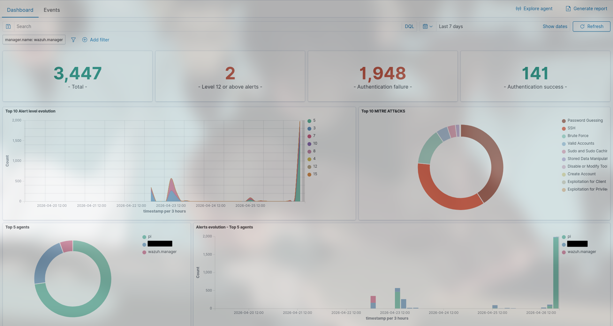
*Figure 1: Wazuh main dashboard displaying alert volume across the assessment period*

---

## Architecture

```
Fedora Laptop (Attacker + Wazuh Manager)
│
├── Wazuh Manager (Docker)
│   ├── wazuh.manager:4.14.4
│   ├── wazuh.indexer:4.14.4
│   └── wazuh.dashboard:4.14.4
│
└── Attack Tools
    ├── Hydra
    └── SecLists/rockyou.txt

Raspberry Pi 5 (Target Endpoint)
└── Wazuh Agent 4.14.5
    ├── Monitored: systemd journal
    ├── Monitored: /etc/passwd
    ├── Monitored: /etc/shadow
    ├── Monitored: /etc/sudoers
    └── Monitored: /var/spool/cron
```
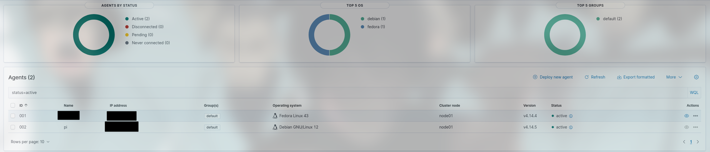
*Figure 2: Target endpoint (Pi) confirmed active and reporting to Wazuh manager prior to assessment*

---

## Finding 1: SSH Brute Force
**MITRE ATT&CK:** T1110.001 — Brute Force: Password Guessing
**Tactic:** Credential Access
**Severity:** High
**Reference:** https://attack.mitre.org/techniques/T1110/001/

### Gap Evidence
The target endpoint was configured with a local account `jsmith` using the password `password` — ranked among the top 10 most common passwords globally. Password authentication over SSH was explicitly enabled in `/etc/ssh/sshd_config`, providing an exposed attack surface on port 22.
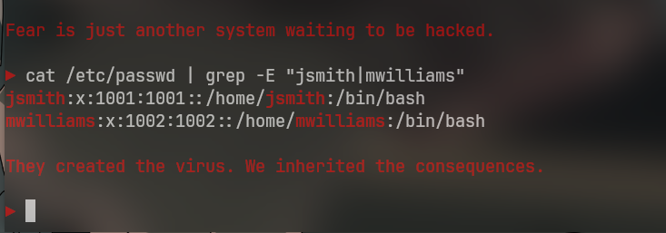
*Figure 3: Weak user accounts identified on target endpoint — gap evidence*
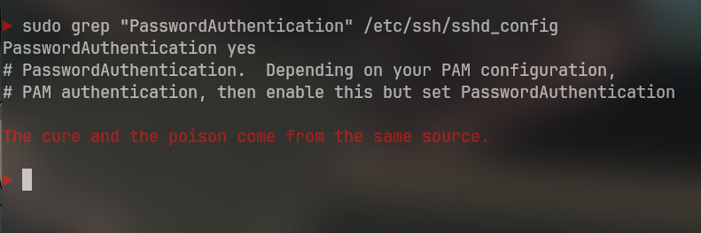
*Figure 4: Password authentication explicitly enabled over SSH — exposed attack surface on port 22*
### Attack Execution
Hydra was used to perform an automated credential attack against the SSH service using the rockyou.txt wordlist — a 14 million entry dictionary derived from real-world breach data.

```bash
hydra -l jsmith -P /usr/share/SecLists/Passwords/Leaked-Databases/rockyou.txt ssh://PI_IP -t 4 -V
```

The password `password` was successfully identified within seconds of launching the attack.
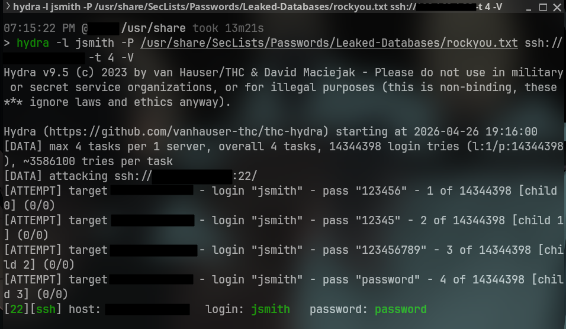
*Figure 5: Hydra credential attack success — jsmith password cracked using rockyou.txt wordlist (T1110.001)*
### Detection
Wazuh successfully detected the brute force pattern through repeated failed authentication events forwarded via the systemd journal.

- **Rule 5503** — PAM: User login failed
- **Rule 2501** — syslog: User authentication failure  
- **Rule 2502** — syslog: User missed the password more than one time
- **Rule 5758** — Maximum authentication attempts exceeded
- **Rule 40111** — Multiple authentication failures (brute force correlation)
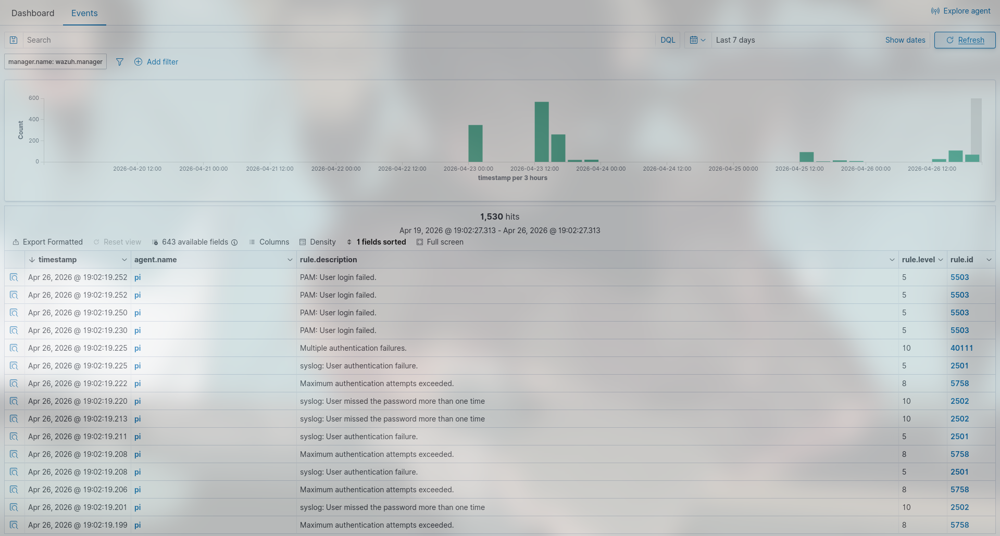
*Figure 6: Wazuh detecting brute force pattern — rules 5503, 2501, 2502, 5758, 40111 fired in real time*
### Mitigation
**MITRE:** M1042 — Disable or Remove Feature or Program
**MITRE:** M1032 — Multi-factor Authentication
https://attack.mitre.org/mitigations/M1042/
https://attack.mitre.org/mitigations/M1032/

1. Disable password authentication — enforce key-based only:
```bash
# /etc/ssh/sshd_config
PasswordAuthentication no
```
2. Enforce strong password policy — minimum 12 characters
3. Tune Fail2ban to ban after 3 failures
4. Deploy MFA as second layer of defense
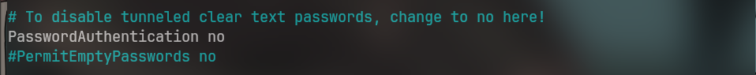
*Figure 9: Password authentication disabled — SSH now enforces key-based authentication only*
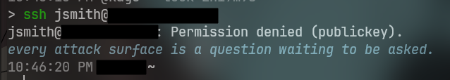
*Figure 10: SSH connection refused confirming successful remediation of Finding 1*

---

## Finding 2: Local Account Creation
**MITRE ATT&CK:** T1136.001 — Create Account: Local Account
**Tactic:** Persistence
**Severity:** High
**Reference:** https://attack.mitre.org/techniques/T1136/001/

### Gap Evidence
The compromised account `jsmith` was a member of the `sudo` group — granting full administrative privileges without justification. This over-privileged configuration allowed an attacker to create new system accounts without additional exploitation.
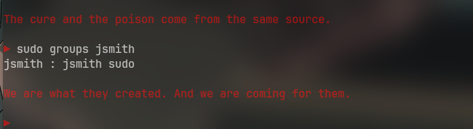
*Figure 11: jsmith confirmed as over-privileged sudo group member — misconfiguration enabling lateral movement*
### Attack Execution
After gaining access via cracked credentials, a backdoor account was created using native Linux tooling — no additional malware required.

```bash
ssh jsmith@PI_IP
sudo useradd -m -s /bin/bash backdoor
sudo passwd backdoor
```
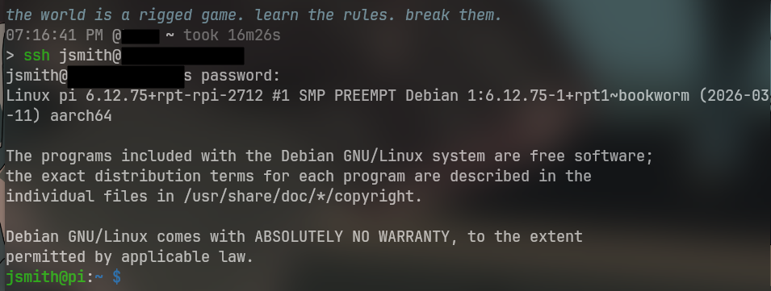
*Figure 11: Attacker authenticated as jsmith following successful credential attack*
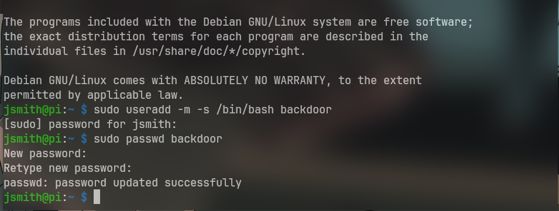
*Figure 12: Backdoor account created using useradd — no malware required (T1136.001)*

### Detection
Wazuh detected the new account creation through systemd journal forwarding.

- **Rule 5901** — New user added to the system
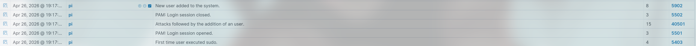
*Figure 13: Wazuh detecting new account creation via systemd journal forwarding — rule 5901*
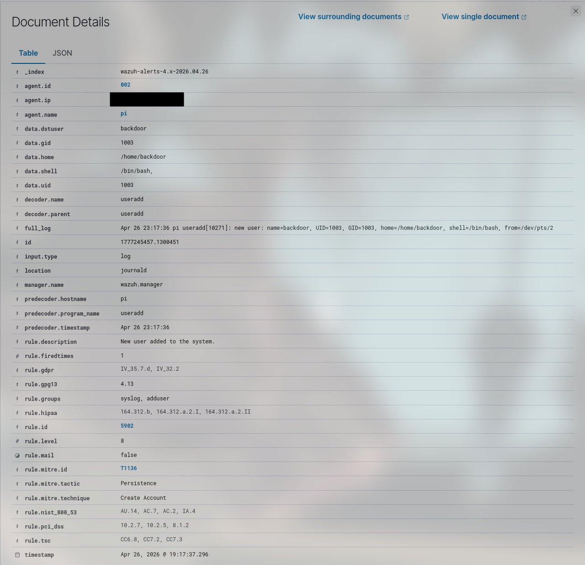
*Figure 14: Full alert detail — account creation event with timestamp, rule, and agent context*
### Mitigation
**MITRE:** M1026 — Privileged Account Management
**MITRE:** M1018 — User Account Management
https://attack.mitre.org/mitigations/M1026/
https://attack.mitre.org/mitigations/M1018/

1. Apply principle of least privilege — remove jsmith from sudo:
```bash
sudo deluser jsmith sudo
```
2. Audit sudo group membership regularly:
```bash
grep -Po '^sudo.+:\K.*$' /etc/group
```
3. Remove unauthorized accounts:
```bash
sudo userdel -r backdoor
```
4. Implement PAM restrictions on account creation
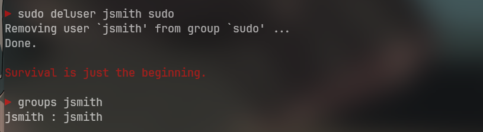
*Figure 15: jsmith sudo privileges revoked — principle of least privilege enforced*
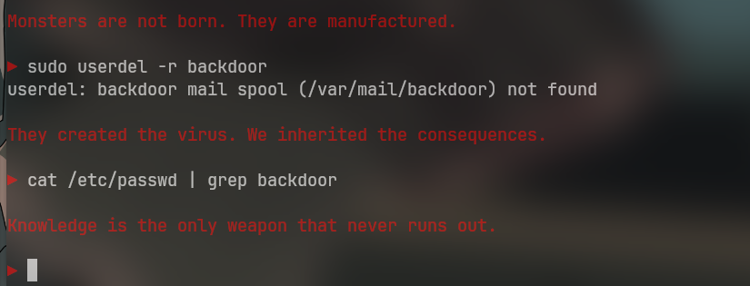
*Figure 16: Backdoor account successfully removed from target endpoint — Finding 2 remediated*

---

## Finding 3: Cron Job Persistence
**MITRE ATT&CK:** T1053.003 — Scheduled Task/Job: Cron
**Tactic:** Persistence, Execution
**Severity:** Medium
**Reference:** https://attack.mitre.org/techniques/T1053/003/

### Gap Evidence
Following successful access, the attacker had unrestricted ability to modify crontabs. No restrictions existed on `/var/spool/cron` and no alerting was configured for crontab modifications prior to this exercise.
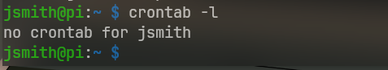
*Figure 17: Crontab baseline — no restrictions preventing unauthorized cron job creation*
### Attack Execution
A malicious cron job was injected to simulate persistent callback behavior — running every minute automatically regardless of user login state.

```bash
(crontab -l 2>/dev/null; echo "* * * * * echo 'persistence' >> /tmp/persistence.log") | crontab -
```

```bash
crontab -l
```
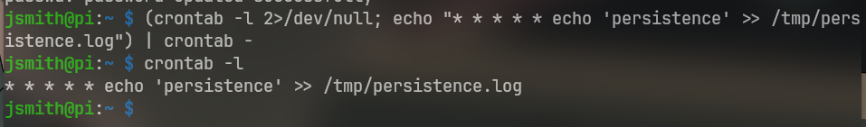
*Figure 18: Persistent cron job injected — simulating adversary callback mechanism (T1053.003)*
### Detection
Wazuh File Integrity Monitoring detected the crontab modification in real time through syscheck configured on `/var/spool/cron`.

- **Rule 550** — Integrity checksum changed
- **Rule 554** — File added to the system
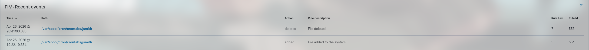
*Figure 19: Wazuh File Integrity Monitoring detecting crontab modification — rules 550 and 554 fired*

### Mitigation
**MITRE:** M1018 — User Account Management
**MITRE:** M1022 — Restrict File and Directory Permissions
https://attack.mitre.org/mitigations/M1018/
https://attack.mitre.org/mitigations/M1022/

1. Remove malicious cron job:
```bash
sudo crontab -u jsmith -r
```
2. Restrict crontab access via whitelist:
```bash
echo "root" | sudo tee /etc/cron.allow
echo "YOUR_MAIN_USER" | sudo tee -a /etc/cron.allow
```
3. Restrict permissions on cron directories:
```bash
sudo chmod 700 /var/spool/cron
sudo chmod 700 /etc/cron.d
```
4. Audit all user crontabs regularly:
```bash
for user in $(cut -f1 -d: /etc/passwd); do sudo crontab -u $user -l 2>/dev/null; done
```
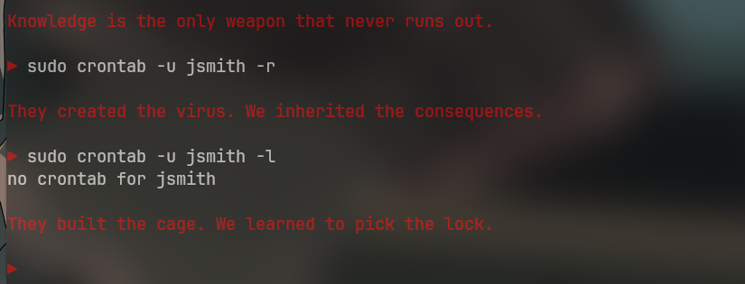
*Figure 20: Malicious cron job removed — crontab cleared confirming Finding 3 remediated*
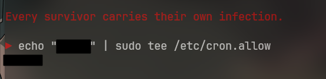
*Figure 21: cron.allow whitelist enforced — unauthorized users denied crontab access*

---

## Lessons Learned

**Detection Engineering gap:** During the initial setup of my Wazuh agent, I noticed that my Raspberry Pi doesn't use traditional log files, it uses `systemd` journal instead. Logs such as `/var/log/auth.log` does not exist by default, which I had to explicitly configure inside of `ossec.conf`. Inside of a production deployment, this would be a silent monitoring gap.

**Attack chain realism:** Substantial amounts of successful attacks occur everyday due to misconfigurations and the lack of centralized monitoring. In this assessment, I enacted the Initial Access and Persistence phases of the MITRE ATT&CK framework by brute forcing SSH which led to account creation enacting as a backdoor that enabled `cron` persistence, successfully demonstrating how this assessment reflects real adversary behavior where initial access is just the beginning.

**Purple team value:** My idea for this project immediately defaulted to purple teaming tactics — execute attacks against my own detection infrastructure, offering something passive monitoring cannot: validation. Three real findings were identified, remediated, and documented that would not have been discoverable otherwise.

I chose purple team strategies and methodologies because I believe purple teaming offers a unique opportunity, especially in a homelab environment. The objective was simple: build the defense, break it, prove it works, and document everything. This exercise produced not only technical findings mapped to MITRE ATT&CK, but a repeatable methodology for continuous security validation.

---

## Conclusion

Operation Nox demonstrated that even a minimal homelab environment contains exploitable misconfigurations when left unaudited. Three MITRE ATT&CK techniques were successfully executed and detected — validating Wazuh's detection capability while exposing gaps in default agent configuration.

The full attack chain — credential access, persistence via account creation, and cron-based persistence — mirrors real-world intrusion patterns documented in MITRE ATT&CK. Each finding was remediated and verified, closing the identified gaps.

This exercise will be expanded with additional techniques, custom Wazuh detection rules, and a second monitored endpoint as the homelab matures.

**Tools Used:**
- Wazuh 4.14.4/5
- Hydra
- SecLists/rockyou.txt
- MITRE ATT&CK Navigator

**Frameworks Referenced:**
- MITRE ATT&CK
- MITRE D3FEND
- NIST 800-61 Incident Response